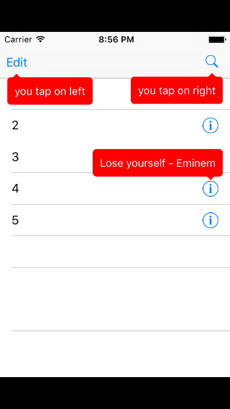

# SZEasyTipView

[](https://travis-ci.org/Song Zhou/SZEasyTipView)
[](http://cocoapods.org/pods/SZEasyTipView)
[](http://cocoapods.org/pods/SZEasyTipView)
[](http://cocoapods.org/pods/SZEasyTipView)

## Disclaimer
This prject is line by line copy from [EasyTipView](https://github.com/teodorpatras/EasyTipView)
## Example

To run the example project, clone the repo, and run `pod install` from the Example directory first.



## Usage
instantiate a object using this method:

```objc
- (instancetype)initWithText:(NSString *)text config:(SZConfig * __nullable)config delegate:(id<SZEasyTipViewDelegate> __nullable)delegate;

```

and present it in specific superview, or pass nil(will presented in rootView)

```objc
- (void)showForView:(UIView *)view withinSuperView:(UIView * __nullable)superView animated:(BOOL)animated;
```

if you want attach to `UIBarItem` subclass, using this method:

```objc
- (void)showForItem:(UIBarItem *)item withinSuperView:(UIView * __nullable)superView animated:(BOOL)animated;
```
or you can just present a tipView without explict instantiate one.

```objc
+ (void)showForView:(UIView *)view withinSuperView:(UIView * __nullable)superView text:(NSString *)text config:(SZConfig * __nullable)config delegate:(id<SZEasyTipViewDelegate> __nullable)delegate animated:(BOOL)animated;
```

### config
you can config apperance and animation of the tip view using `SZConfig`, pass `nil` will use default config. For more information, please reference to `SZConfig` Class.

## Requirements

iOS 8+

## Installation

SZEasyTipView is available through [CocoaPods](http://cocoapods.org). To install
it, simply add the following line to your Podfile:

```ruby
pod "SZEasyTipView"
```

## Author

Song Zhou, zhousong1993@gmail.com

## License

SZEasyTipView is available under the BSD license. See the LICENSE file for more info.
